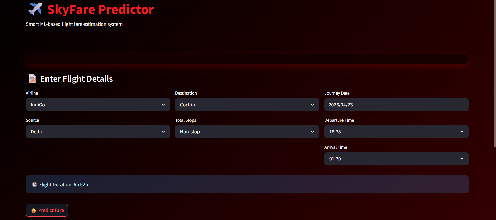
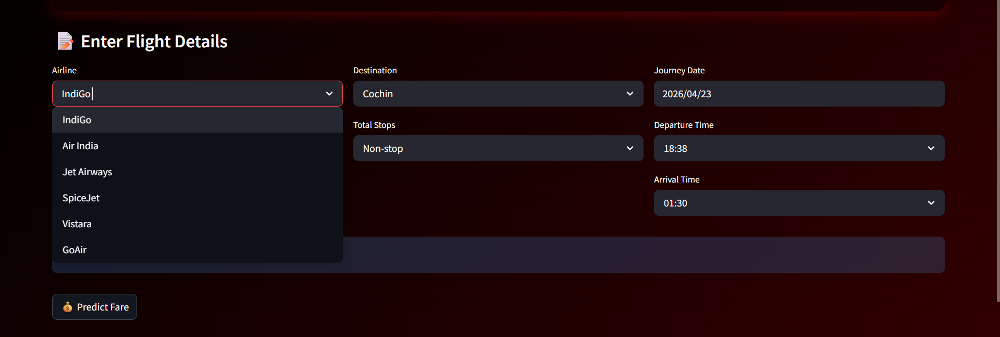

# ✈️ SkyFare — Flight Fare Predictor

> A smart, ML-powered web app that estimates Indian domestic flight fares in real time using a trained Random Forest model.



---

## 📌 About the Project

**SkyFare** is a machine learning-based flight fare prediction system built for Indian domestic routes. Users can enter flight details such as airline, source, destination, number of stops, journey date, and departure/arrival times — and the app instantly predicts the estimated fare in INR.

This project was built to explore end-to-end ML deployment using Streamlit, making it interactive and beginner-friendly.

---

## ✨ Features

- 🔮 **Real-time fare prediction** using a trained Random Forest Regressor
- 🗓️ Accepts **journey date, departure & arrival time** as inputs
- 🛫 Supports **6 major Indian airlines** including IndiGo, Air India, SpiceJet, Vistara, GoAir, and Jet Airways
- 🗺️ Covers **popular Indian routes** (Delhi, Mumbai, Chennai, Kolkata → Cochin, Hyderabad, etc.)
- 🕒 **Auto-calculates flight duration** from departure and arrival times
- 🎨 Clean dark-themed UI with a dynamic **fare indicator** (Budget / Moderate / Expensive)
- ⚡ Fast and lightweight — runs locally with a single command

---

## 🛠️ Tech Stack

| Layer | Tool |
|---|---|
| Frontend / UI | [Streamlit](https://streamlit.io/) |
| ML Model | Scikit-learn — Random Forest Regressor |
| Data Processing | Pandas, NumPy |
| Language | Python 3.9+ |
| Model Serialization | Pickle (`.pkl`) |

---

## 📁 Folder Structure

```
Flight_project/
│
├── app.py                  # Main Streamlit application
├── flightdata.csv          # Raw dataset used for training
├── requirements.txt        # Python dependencies
├── README.md               # Project documentation (you're here!)
│
├── models/
│   └── rd_random.pkl       # Trained Random Forest model
│
├── src/
│   ├── config.py           # Constants: airlines, sources, destinations, mappings
│   └── preprocess.py       # Feature engineering and input transformation
│
└── assets/
    └── screenshot.png      # App Screenshot
```

---

## 🚀 How to Run Locally

### 1. Clone the repository

```bash
git clone https://github.com/rounak2601/flight-fare-predictor.git
cd flight-fare-predictor
```

### 2. Create and activate a virtual environment (optional but recommended)

```bash
python -m venv venv

# Windows
venv\Scripts\activate

# macOS / Linux
source venv/bin/activate
```

### 3. Install dependencies

```bash
pip install -r requirements.txt
```

### 4. Run the app

```bash
streamlit run app.py
```

The app will open in your browser at `http://localhost:8501` 🎉

---

## 📊 Dataset

- **File:** `flightdata.csv`
- **Source:** [Kaggle — Flight Price Prediction Dataset](https://www.kaggle.com/datasets/nikhilmittal/flight-fare-prediction-mh)
- **Records:** ~10,000+ flight entries
- **Features used:**
  - Airline, Source, Destination
  - Total Stops
  - Date of Journey (day & month)
  - Departure Time (hour & minute)
  - Arrival Time (hour & minute)
  - Duration (hours & minutes)
- **Target:** Price (in INR ₹)

---

## 🤖 Model Information

| Property | Detail |
|---|---|
| Algorithm | Random Forest Regressor |
| Library | Scikit-learn |
| Input Features | 16 (numeric + one-hot encoded source) |
| Saved as | `models/rd_random.pkl` |
| Evaluation Metric | MAE, RMSE (see training notebook) |

The model was trained after preprocessing the raw CSV — parsing date/time fields, encoding categorical variables (airline, source, destination), and engineering duration features from departure and arrival times.

---

## 📸 Screenshots


| App Interface | Fare Result |
|---|---|
|  |  |

---

## 📦 Requirements

Install all dependencies with:

```bash
pip install -r requirements.txt
```

Key packages:

```
streamlit
scikit-learn
pandas
numpy
```

---

## 🤝 Contributing

Contributions, issues, and feature requests are welcome!

1. Fork the project
2. Create your feature branch: `git checkout -b feature/my-feature`
3. Commit your changes: `git commit -m "Add my feature"`
4. Push to the branch: `git push origin feature/my-feature`
5. Open a Pull Request

---

## 📄 License

This project is licensed under the **MIT License**.

```
MIT License

Copyright (c) 2026 Rounak Kumar Tilante

Permission is hereby granted, free of charge, to any person obtaining a copy
of this software and associated documentation files (the "Software"), to deal
in the Software without restriction, including without limitation the rights
to use, copy, modify, merge, publish, distribute, sublicense, and/or sell
copies of the Software, and to permit persons to whom the Software is
furnished to do so, subject to the following conditions:

The above copyright notice and this permission notice shall be included in all
copies or substantial portions of the Software.

THE SOFTWARE IS PROVIDED "AS IS", WITHOUT WARRANTY OF ANY KIND, EXPRESS OR
IMPLIED, INCLUDING BUT NOT LIMITED TO THE WARRANTIES OF MERCHANTABILITY,
FITNESS FOR A PARTICULAR PURPOSE AND NONINFRINGEMENT.
```

---

## 👨‍💻 Author

**Rounak Kumar Tilante**
- GitHub: [@rounak2601](https://github.com/rounak2601)
- LinkedIn: [linkedin.com/in/rounak-tilante-a9719b257](https://www.linkedin.com/in/rounak-tilante-a9719b257/)

---

<p align="center">Made with ❤️ and Python</p>
